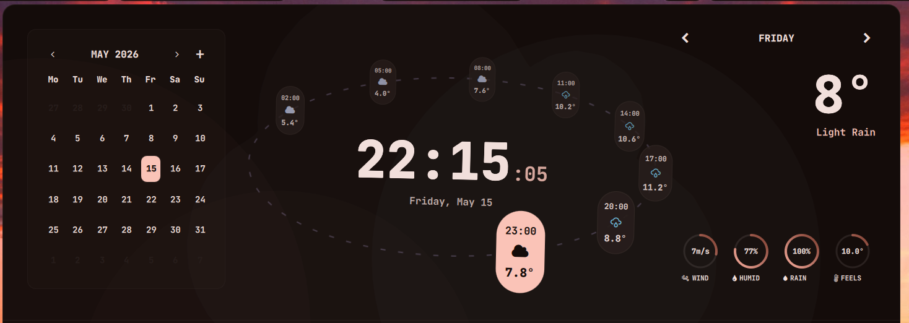
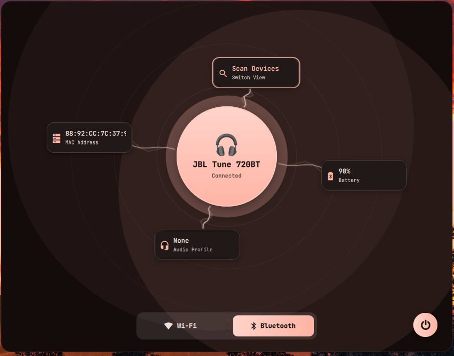
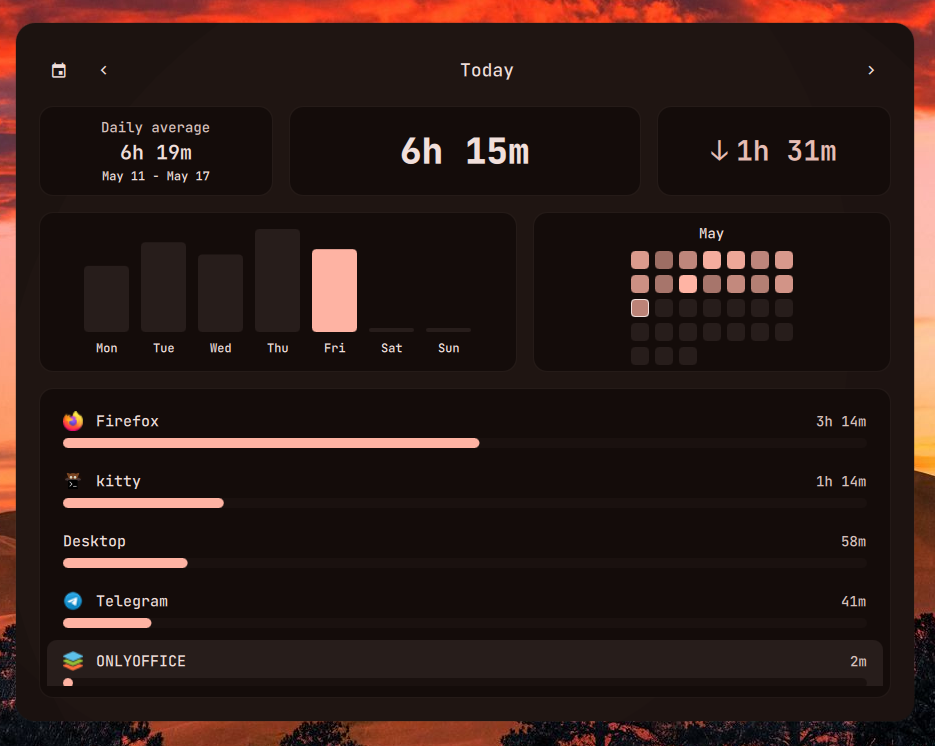
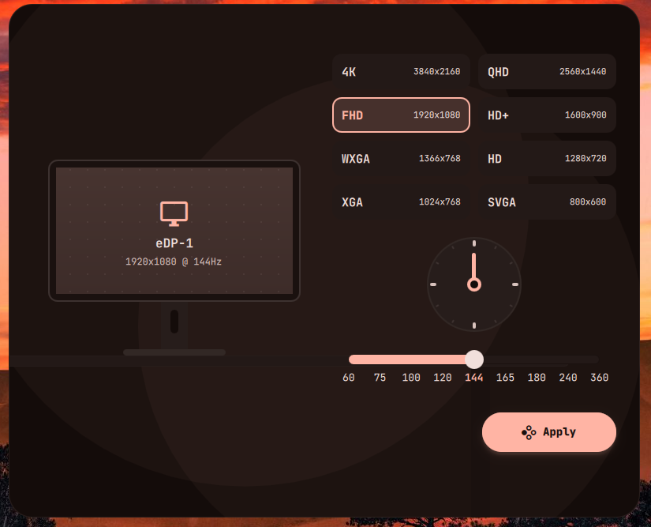

# nixos-rice

A **NixOS + flakes** adaptation of [**ilyamiro**'s desktop rice](https://github.com/ilyamiro/nixos-configuration),
with a guided TUI installer for a clean install from the NixOS minimal ISO.

---

## ⚠️ Credits & honesty

- **All of the actual rice** — the Hyprland setup, the Quickshell shell, the matugen
  theming, the scripts, the look and feel — is the work of **[ilyamiro](https://github.com/ilyamiro)**.
  Original config: <https://github.com/ilyamiro/nixos-configuration>.
- **Wallpapers** are ilyamiro's too: <https://github.com/ilyamiro/shell-wallpapers>.
  Please ⭐ and support the original author (he has a [ko-fi](https://ko-fi.com/ilyamiro)).
- **This repository's contribution** is limited to: converting the config to **flakes**,
  parameterizing the username/host/GPU so it isn't hard-wired to one machine, splitting GPU
  drivers into modules, and writing the **Ink TUI installer**.
- 🤖 **This NixOS/flakes adaptation and the installer were written with AI (Claude).**
  Read the code before running it — especially the installer, which **erases a disk**.

---

## What this gives you

- Hyprland + Quickshell rice (ilyamiro's), via **home-manager**
- A pinned **flake** (`nixpkgs` unstable + `home-manager`)
- **GRUB** (UEFI), **PipeWire** audio, GPU drivers (NVIDIA open / NVIDIA proprietary / AMD / Intel)
- An installer that partitions an NVMe/SATA disk and installs the whole thing

## Install (clean install from NixOS minimal ISO)

1. Boot the **NixOS minimal ISO** in **UEFI** mode.
2. Get online (e.g. `nmtui` for Wi‑Fi, or plug in Ethernet).
3. Run the installer as root:

   ```bash
   sudo bash -c "$(curl -fsSL https://raw.githubusercontent.com/vincentisvalid/nixos-rice/master/installer/install.sh)"
   ```

The TUI will ask for the target disk (with a typed confirmation, since it gets **erased**),
your username/hostname/password, timezone/locale, **GPU vendor**, and swap size. It then
partitions, clones this repo to `/mnt/etc/nixos`, generates a per-machine
`hardware-configuration.nix`, downloads the wallpapers, runs `nixos-install`, sets your
password, and offers to reboot. On failure it shows the failing step, the captured stderr,
and the path to the full log (`/tmp/nixos-rice-install.log`).

> The disk you pick is **completely wiped**. Back up first.

## Layout

```
flake.nix                 # inputs (nixpkgs, home-manager) + nixosConfiguration
host.nix                  # per-machine: username/hostname/gpu/timezone/locale (installer writes this)
configuration.nix         # system config (parameterized)
home.nix                  # home-manager entry (imports config/programs/*)
hardware-configuration.nix# placeholder — regenerated per machine by the installer
modules/gpu/*.nix         # nvidia-open / nvidia / amd / intel
config/                   # ilyamiro's rice (programs + hyprland session)
installer/                # Ink TUI installer + bootstrap install.sh
```

## After install / day-to-day

The config lives at `/etc/nixos` (a git checkout). Rebuild with:

```bash
sudo nixos-rebuild switch --flake /etc/nixos     # alias: `update`
```

Edit machine settings in `/etc/nixos/host.nix` (username/hostname/GPU/timezone/locale).
To change the GPU driver, set `gpu` to one of `nvidia-open` / `nvidia` / `amd` / `intel`
(matching a file in `modules/gpu/`) and rebuild.

## Notes & known rough edges

- `nix` was not available where this was adapted, so the flake was **not build-tested**
  before publishing. Run `nix flake check` / `nixos-rebuild build --flake .#<host>` and expect
  to iterate on the package list the first time.
- A few packages from the original config were flagged in `configuration.nix`:
  `python314` (not packaged — `python311` is used) and `jdk8` (marked insecure — commented out).
- NVIDIA open module assumes Turing+ (RTX 20xx–40xx). If a bleeding-edge kernel breaks the
  driver build, switch `nvidiaPackages.stable` → `production` in `modules/gpu/nvidia-open.nix`.

## Previews (ilyamiro's desktop)











